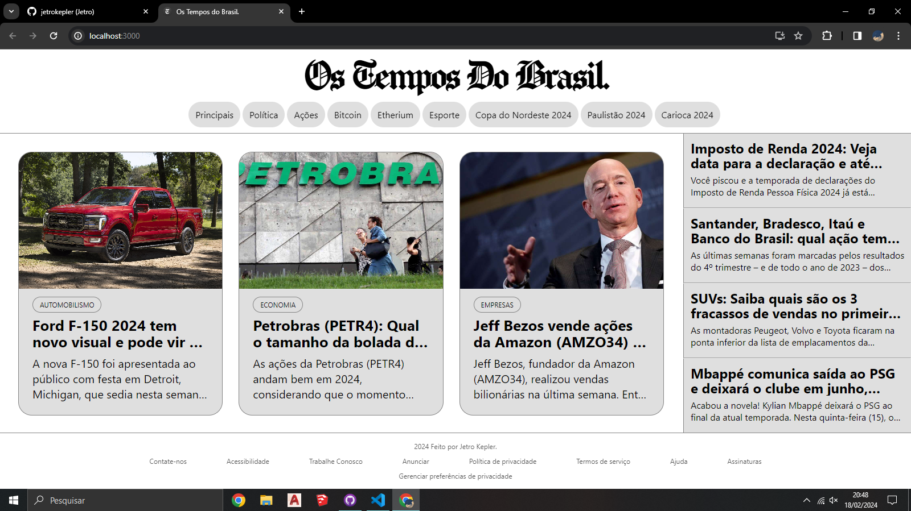
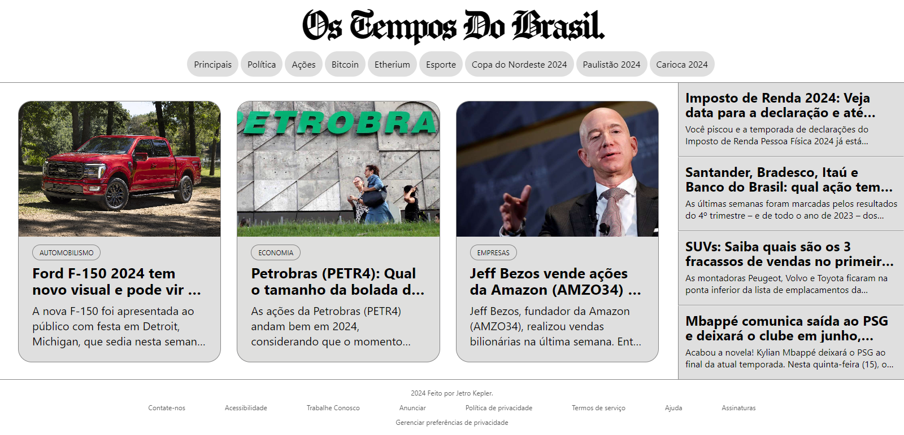

# Jornal com React.js 📰

### _Jetro Kepler, 3º Informática._ 💻

Este projeto nasceu com base em uma atividade proposta por meu professor, de criar, primeiramente, um website que tivesse uma altura fixa (sem rolagem vertical), um header e um footer definido e um menu lateral, e três elementos igualmente espaçados na parte central da página.

O original é que fosse criado apenas com HTML E CSS, mas o criei usando React.js, que eu já vinha estudando. Queria que o site tivesse algum sentido, então sua interface foi feita inspirado em um site de notícias.

